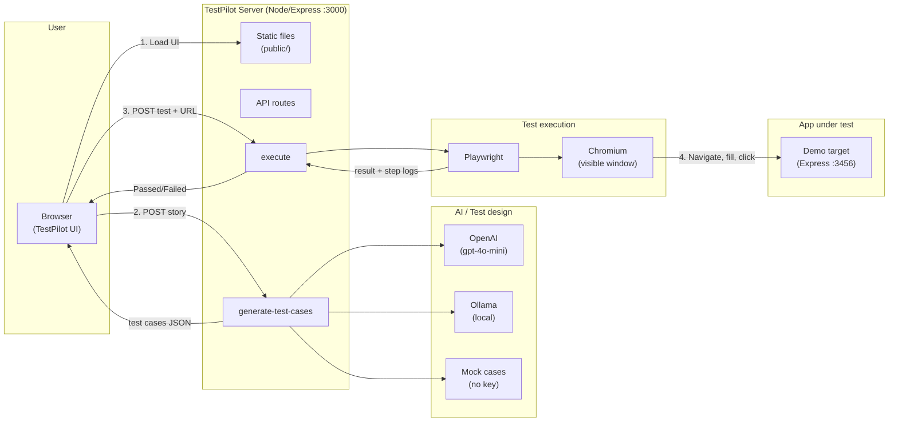
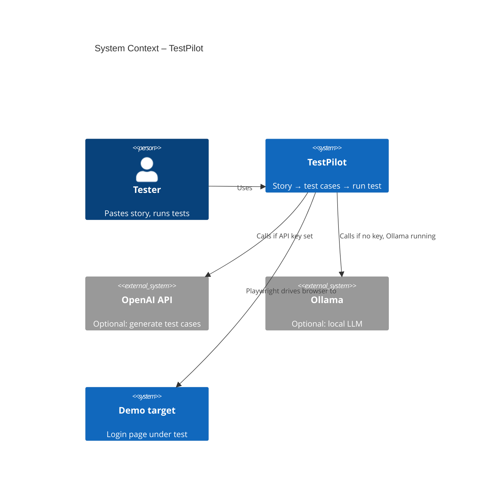
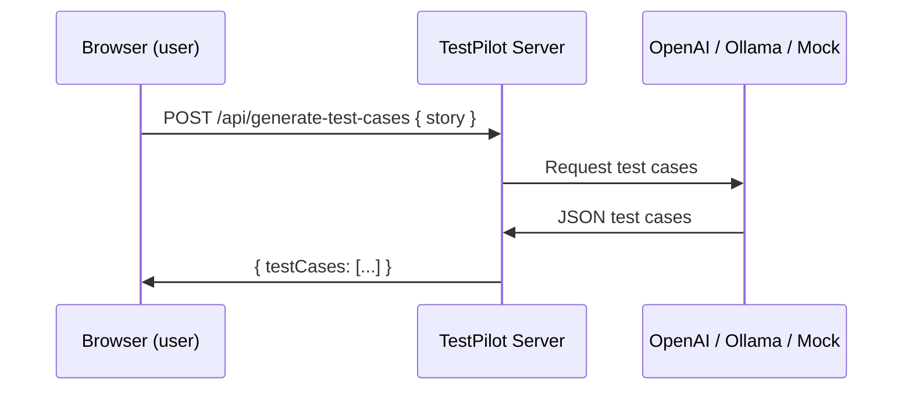
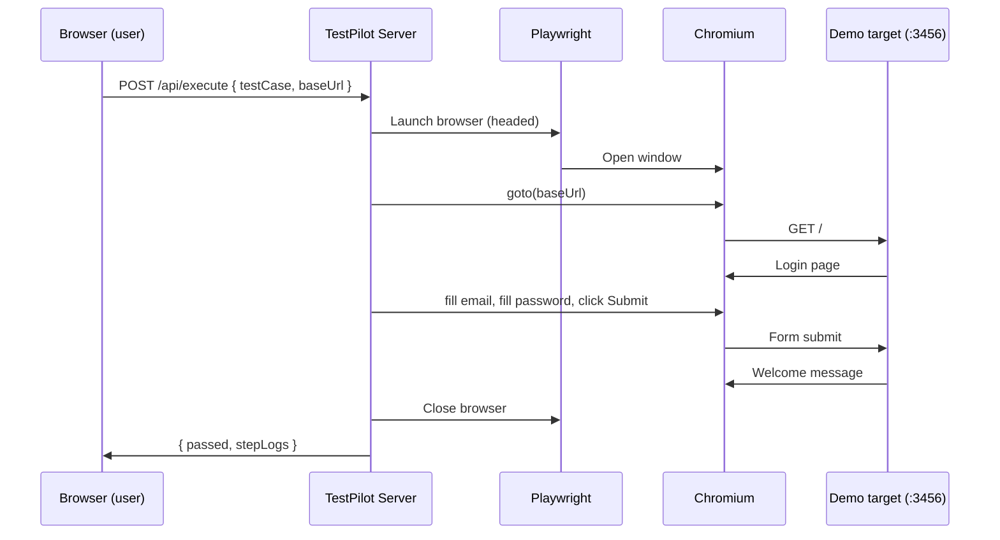
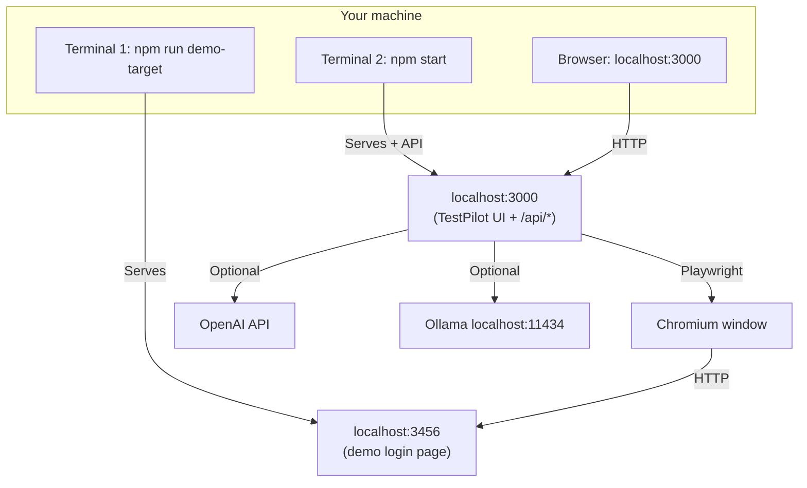

# TestPilot – Architecture

## High-level flow

## Component diagram

## Sequence: Generate test cases

## Sequence: Run first test

## Deployment view

## Key files

| Component        | Path                    | Role                                      |
|-----------------|-------------------------|-------------------------------------------|
| TestPilot server | `server.js`             | Express, static files, API routes          |
| Generate API    | `api/generate.js`       | OpenAI / Ollama / mock → test cases        |
| Execute API     | `api/execute.js`        | Playwright → steps against baseUrl        |
| Frontend        | `public/index.html`     | Story input, test list, run, results      |
| Demo target     | `demo-target/`          | Minimal login page (app under test)       |
| Demo server     | `demo-target-server.js` | Serves demo-target on :3456               |
